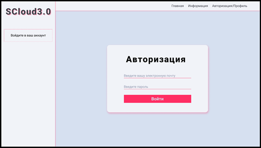
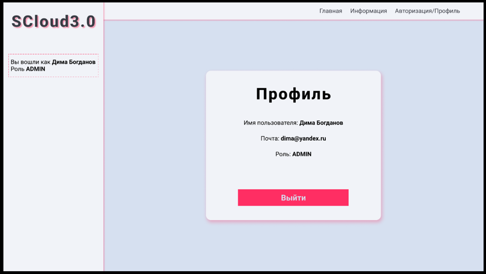
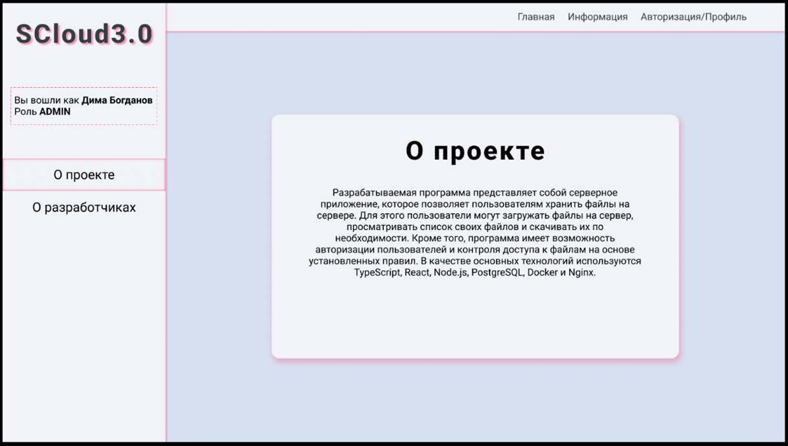
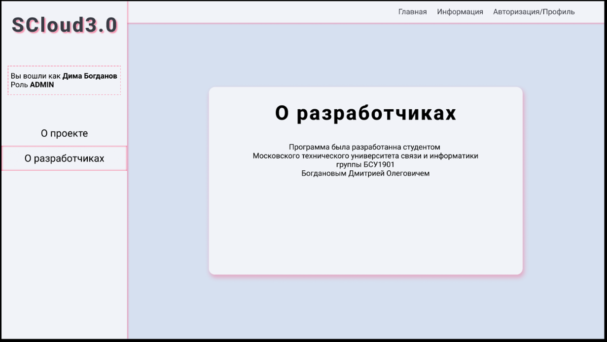
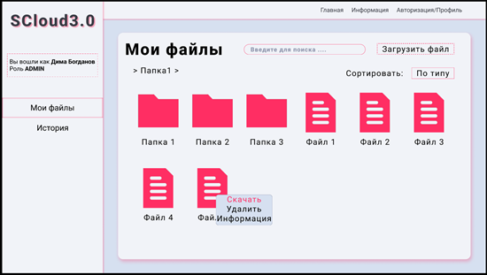
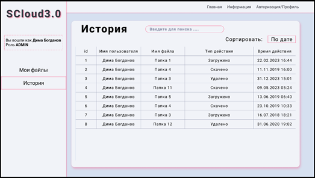

# FileStorageApp
Файловая система хранения данных. Моя ВКР.
Это FullStack приложение позволяет загружать, хранить и скачивать файлы на сервере.
Существует система ролей, которая позволяет администраторам создавать новых пользователей или смотреть их историю.
Состоит из 3 частей:
- Графический интерфейс на React
- Серверная часть на Nodejs
- База данных на PostgreSQL

<a href="./Богданов_ДО_ВКР.pdf">Почитать ВКР можно тут</a>

Окно авторизации:  

Окно профиля:  

Окно проекта:  

Окно разработчиков:  

Окно файлов:  

Окно истории:  

